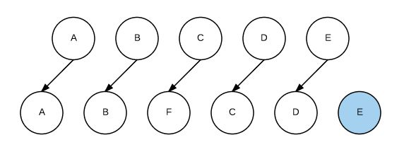

## 你知道key的作用吗？

分析：这是一道特别常见的问题，主要考查大家对虚拟DOM和patch细节的掌握程度，能够反映面试者理解层次。


思路分析：总分总模式

1. 给出结论，key的作用是用于优化patch性能
2. key的必要性
3. 实际使用方式
4. 总结：可从源码层面描述一下vue如何判断两个节点是否相同


回答范例：

1. key的作用主要是为了更高效的更新虚拟DOM。
2. vue在patch过程中**判断两个节点是否是相同节点是key是一个必要条件**，渲染一组列表时，key往往是唯一标识，所以如果不定义key的话，vue只能认为比较的两个节点是同一个，哪怕它们实际上不是，这导致了频繁更新元素，使得整个patch过程比较低效，影响性能。
3. 实际使用中在渲染一组列表时key必须设置，而且必须是唯一标识，应该避免使用数组索引作为key，这可能导致一些隐蔽的bug；vue中在使用相同标签元素过渡切换时，也会使用key属性，其目的也是为了让vue可以区分它们，否则vue只会替换其内部属性而不会触发过渡效果。
4. 从源码中可以知道，vue判断两个节点是否相同时主要判断两者的key和元素类型等，因此如果不设置key，它的值就是undefined，则可能永远认为这是两个相同节点，只能去做更新操作，这造成了大量的dom更新操作，明显是不可取的。


测试代码，[test.html](./test.html)

上面案例重现的是以下过程


不使用key



如果使用key

```
// 首次循环patch A
A B C D E
A B F C D E

// 第2次循环patch B
B C D E
B F C D E

// 第3次循环patch E
C D E
F C D E

// 第4次循环patch D
C D
F C D

// 第5次循环patch C
C 
F C

// oldCh全部处理结束，newCh中剩下的F，创建F并插入到C前面
```


源码中找答案：src\core\vdom\patch.js - sameVnode()